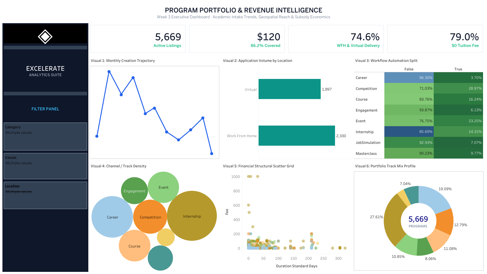

# Excelerate Opportunity Intelligence & Analytics Suite — Team 11


An end-to-end data analytics and visual intelligence workspace analyzing 5,674 platform offerings across 10 verticals[cite: 16]. Developed during the Excelerate Data Visualization Trainee Internship, this repository tracks raw NoSQL data auditing (Week 1), deep exploratory data analysis and Python visual modeling (Week 2), interactive SaaS dashboard design in Tableau (Week 3), and final executive business reporting and deck synthesis (Week 4).

---

## 👥 Project Team & Core Responsibilities

* **Olasope Omolola** — Team Leader & Project Orchestration
* **Sanskar Muneshwar** — Dashboard Architecture & Visual Analytics
* **Sadhna MM** — Technical Documentation & Quality Audit Lead
* **Keerti Betagiri** — Data Insights & Statistical Interpretation Lead
* **Silah Tarbai** — Insights & Analytics Lead
* **Gordan Moenga** — Data Engineering & Validation
* **Muhammad Waqar Tahir** — Pipeline Optimization & QA
* **Nash Were** — Metrics Benchmarking & Validation

---

## 📌 Executive Summary & Key Platform Metrics

Analysis of the post-hygiene dataset (`cleaned_opportunities.csv`, 5,674 records across 43 attributes) revealed five core structural dynamics[cite: 16]:

* **Active Catalog Volume:** 5,674 validated opportunities across 10 verticals (Internship, Career, and Competition constitute ~60% of the entire catalog)[cite: 16].
* **Financial Accessibility:** 78.9% (4,477 opportunities) operate under a zero-tuition free-access model ($0 fee)[cite: 16].
* **Micro-Scholarship Ubiquity:** 86.2% of listings include micro-scholarships, clustering heavily at a standardized token median of **$120**[cite: 16].
* **Delivery Infrastructure:** 74.6% of programs offer remote delivery (41.1% Work From Home, 33.5% Virtual)[cite: 16].
* **Operational Intake Bottleneck:** 85.9% of application pipelines depend on manual review[cite: 16]. Sharp intake spikes align with academic cycles (July, October/November, February/March), creating administrative delays during peak cohorts[cite: 16].

---

## 🖥️ Week 3: Interactive Executive UI Dashboard

Constructed with modern SaaS UI card architecture (`#F4F6F9` canvas, floating white containers, 1px `#E2E8F0` structural boundaries, and a dark brand navigation dock).



### Dashboard Visual Architecture
1. **Left Navigation Dock:** Dark Navy (`#0F172A`) sidebar with dynamic multi-select dropdown filters (`Category`, `Location Format`, `Approval Type`).
2. **Top Executive KPI Strip:** Real-time counters displaying Active Listings (`5,674`), Median Award (`$120`), Remote Delivery (`74.6%`), and Free Access Rate (`78.9%`)[cite: 16].
3. **Visual 1 — Monthly Trajectory:** Dual-axis time series capturing cyclical 4-year intake spikes[cite: 16].
4. **Visual 2 — Application Volume by Delivery Format:** Clean horizontal volume comparison highlighting remote vs. localized offerings[cite: 16].
5. **Visual 3 — Workflow Automation Split:** Cross-tabular highlight matrix contrasting automated tracks (Competitions at ~29.0%) with manual screening tracks (Careers at ~3.7%)[cite: 16].
6. **Visual 4 — Program Density Cluster:** Packed bubble map illustrating relative volume across categories.
7. **Visual 5 — Financial Structural Scatter:** Non-aggregated parameter plane mapping standardized duration against fee/subsidy layers[cite: 16].
8. **Visual 6 — Track Mix Profile:** Dual-axis donut chart displaying category proportions around a centered catalog total.

---

## 📊 Week 2: Python Statistical & Feature Explorations

High-resolution (300 DPI) visualization scripts built in Matplotlib and Seaborn exploring architectural patterns not captured in primary reporting:

| Script / Visual | Analytical Dimension | Key Finding |
| :--- | :--- | :--- |
| **Duration Units (`visual_1`)** | Scheduling Cadence | 75.4% of catalog durations are logged in weekly increments (4,275 offerings)[cite: 17]. |
| **Monetization Donut (`visual_2`)** | Revenue Tiering | 78.9% free access baseline; paid opportunities cluster primarily in Events and Internships. |
| **Scholarship Tiers (`visual_3`)** | Subsidy Sizing | 68.0% of awarded offerings sit in the standard $101–$250 subsidy band. |
| **Feature Adoption (`visual_4`)** | Platform Feature Completeness | Badges (88.8%), Eligibility (88.2%), and Cohort markers (87.7%) are standard; Mentors (19.7%) and Testimonials (3.6%) are underutilized[cite: 17]. |
| **Correlation Matrix (`visual_5`)** | Feature Interdependence | A negative correlation between Program Duration and Incentives ($r = -0.48$) highlights micro-incentive usage for shorter tracks[cite: 17]. |

---

## 📁 Repository Directory Structure

```text
excelerate-data-preparation/
├── data/
│   └── cleaned_opportunities.csv              # Standardized dataset (5,674 rows)
├── week_1_Data-Understanding_Pac.../         # Week 1 data auditing & schema logs
├── week_2_EDA/
│   ├── Week2_EDA_Report_Team_11.docx          # Formal exploratory analysis report
│   ├── scripts/                               # Python visualization scripts
│   │   ├── generate_5_visuals.py
│   │   └── generate_charts_2_and_3.py
│   └── visuals/                               # Generated 300 DPI visual assets
├── week_3_Dashboard/
│   ├── Program Portfolio & Revenue In...twbx  # Tableau Packaged Workbook
│   └── assets/
│       └── dashboard_preview.png              # UI preview rendered above
├── week_4_Reporting/
│   ├── docs/
│   │   ├── Final_Executive_Business_Report.pdf # Final compiled business deliverable
│   │  
│   └── assets/                              # KPI infographics and report exports
         └── Executive_Presentation_Deck.pptx   # Stakeholder briefing slide deck
├── requirements.txt                           # Dependency specifications
├── .gitignore
├── LICENSE
└── README.md

```

---

## 🚀 Execution & Reproducibility Pipeline

**1. Clone Repository & Setup Virtual Environment**

git clone [https://github.com/sanskar00-debug/excelerate-data-preparation.git](https://github.com/sanskar00-debug/excelerate-data-preparation.git)
cd excelerate-data-preparation  

**2. Install Required Dependencies**

pip install -r requirements.txt

**3. Generate Analytical Visuals (Week 2)**

Run the visualization scripts located in week_2_EDA/:

python week_2_EDA/scripts/generate_5_visuals.py
python week_2_EDA/scripts/generate_charts_2_and_3.py

**4. Launch the Interactive Dashboard (Week 3)**

Open week_3_Dashboard/Program Portfolio & Revenue Intelligence.twbx via Tableau Desktop or Tableau Public (v2024.1+).

---

## 🗒️ Milestone Outcomes & Insights

**Week 1 — Tabular Schema Clarity & Audit:** Clean separation between transactional metadata markers and natural content variables; resolved missing values, standardized data types, and unified currency tags.  
**Week 2 — Statistical Readiness & Visual EDA:** Unification of irregular duration intervals into a standardized day index; identified the $r = -0.48$ reward-duration correlation and proved that the catalog operates as a USD-denominated, remote-first ecosystem. 
**Week 3 — SaaS Dashboard Implementation:** Successfully converted static exploratory insights into a production-grade 3×2 card dashboard with dynamic left-dock parameter filtering, dual-axis donut charts, and live cross-filtering capabilities.
**Week 4 — Strategic Synthesis & Business Action:**
**1.Intake Automation Expansion:*** The 85.9% manual review dependency creates administrative bottlenecks during July and March intake spikes. Deploying objective auto-approval criteria to standard Course and Masterclass listings can significantly reduce turnaround time.  
**2.Template Standardization:** The heavy concentration around 210 days indicates hardcoded default template entries during posting setup. Mandatory duration validation at data entry will yield more realistic timeline forecasting.  
**3.Currency Localization:** USD pricing dominates 82.4% of the catalog. The localized multi-currency model proven in Internships (INR and EUR account for ~23%) should be expanded across paid certificate courses to increase conversion in international student hubs[cite: 16, 17].   

